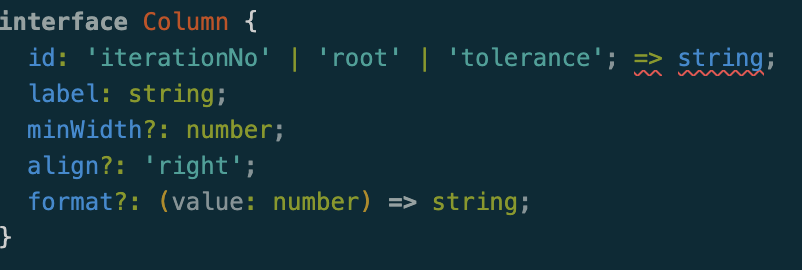
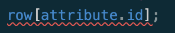
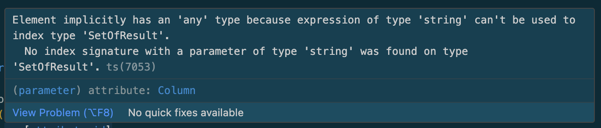
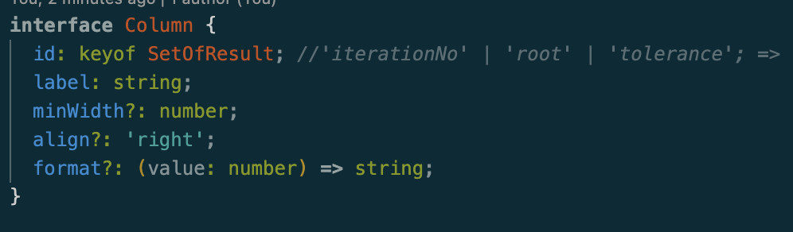
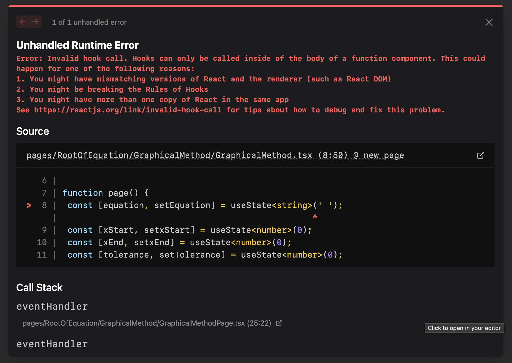
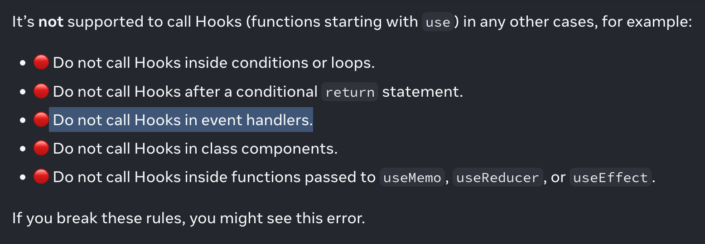
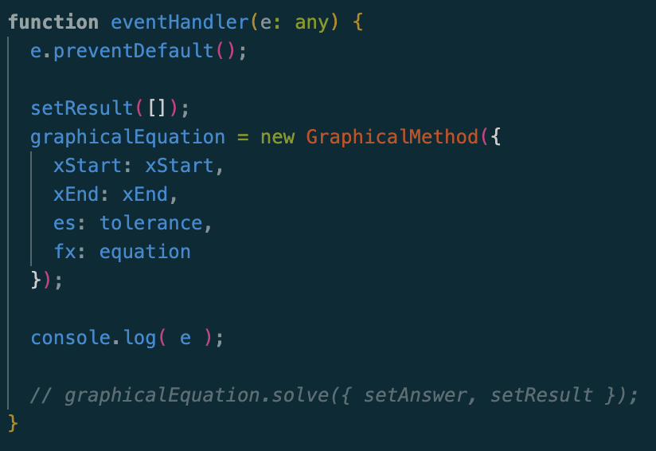

| Task          | Check            |
| ------------- | ---------------- | 
| Add Graph     | - [x] |
| Add Table     | - [x] |
| Format Cartex | - [x] | 

React ไม่ใช่ browser เวลาเรียกหน้าใหม่จะไม่ใช่การเปลี่ยนหน้า เเต่เป็นการ Render ( virtual dom )

CSR = Cilent Side Rendering
SSR = Server Side Rendering

Routing เป็นการใช้ CSR จะต่างกับ SSR ตรงที่ CSR จะขอ JS มา Render ใหม่ เเต่ SSR, SSR จะรัน Component มาก่อนเเล้วส่งมาให้ใหม่

เเล้วขอดีของมันก็คือ CSR จะสามารถทำ Transition สวย ๆ ได้ เเละเวลาเเก้ไขเเค่บางส่วน เเทนที่จะ Render ใหม่ทั้งหมด ก็ Render เเค่บางส่วน

React Server Component

<hr>

**11 october 2566**

- [x] Add prop column to table data in component/dataTable
- [x] Change input field Interface
- [x] Read data from input field
- [x] เพิ่ม Prettier eslint เเละ prettier tailwind
- [x] Install Katex
- [x] Add use state to change equation in `<InlineMath>`
- [x] Change `normal eval` to `math.eval`
- [x] Add graph
- [x] Implement onsubmit function

16:08 ขณะทำการเพิ่ม prop : attribute มีปัญหาบางอย่างเกิดขึ้น

โดย เราทำการเเก้ Interface ของ Column ไปเป็น String



มันจึง Error เเบบนี้




เพราะอะไร
1. อาจจะเพราะ key ของ object ไม่ใช่ type string

จริงด้วย เพราะว่าใน column เราจะใช้ column.id เพื่อเข้าถึงค่าของ row ในเเถวนั้น

เเต่ column.id ที่จะเอาไปเป็น key เรา assign เป็น Type string ซึ่งความจริง เป็น type ของ keyOf class นั้นดังรูป


23.02 `npm install Katex` and implement Math line in to `RootOfEquation.tsx`
https://www.npmjs.com/package/react-katex


Thursday 12 October 2566
- [x] Add graph in to numerical website
- [x] Modal to handle no input when submit
- [x] Modal to handle equation is incalculable
- [ ] Modal when user type wrong number of Range and Tolerance
- [ ] Toggle bar to see table and grap after click calculate
- [ ] Implement all root of equation 

10:00 ติด Bug ของ



ไม่รู้เพราะว่าอะไร เเต่เรามาลองหาวิธีการเเก้กันดีกว่า

https://react.dev/warnings/invalid-hook-call-warning

ดูเหมือนเราจะทำผิดตรงที่เรา call hook ใน handle function



 

 โดย Hook ควรประกาศใน `functional hook` and `custom hook`

 ไม่สิอันนี้เราไม่ได้ประกาศการใช้ Hook เราเเค่ใช้ Function Hook นี่

 <hr>
 ปัญหามันหายเมื่อเรา comment ส่วนของ Code new object

 เอ้า
 คืออะไรปิด VSCODE เเล้วเปืดใหม่ได้เแย เเต่ก็เเบบเห็นละนะว่าตอนเเก้ ข้อความเล็กน้อย ๆ เเล้ว Error ไม่เปลี่ยน

ต้นเเก้วสอนไว้ว่าตั้ง Max-w-xl เเละ w-11/12 ในกรณีที่ responsive เข้าสู่ 
Mobile

**TIME** : 10:11

Read ค่าออกมาจาก form input
https://react.dev/reference/react-dom/components/input

``` tsx
function eventHandler(e: any) {
		e.preventDefault();

		setResult([]);
		graphicalEquation = new GraphicalMethod({
			xStart: xStart,
			xEnd: xEnd,
			es: tolerance,
			fx: equation
		});

		const form = e.target;
		const formData = new FormData( form );
		const formJson = Object.fromEntries(formData.entries());
		console.log( formJson );

		graphicalEquation.solve({ setAnswer, setResult });
	}
```

10:24 ปัญหาถัดไปคือ 
`setxStart(formJson.XStart);` ต้องการให้ set ค่าของ x เเต่มันไอไลท์เเดงบอกว่า 
```
Argument of type 'FormDataEntryValue' is not assignable to parameter of 
type 'SetStateAction<number>'.

  Type 'string' is not assignable to type 'SetStateAction<number>'.
  (2345)
```

วิธีเเก้คาดว่าจะต้องหาวิธีการเปลี่ยนจาก Type FormDataEntryValue สู่ number

นี่คือ object json
``` json
{functionInput: '5', Xstart: '0', Xend: '10', Tolerance: '0.000001'}
```


เราใส่ + ไว้หน้า String เเล้วมันก็ทำการเเก้ Type FormDataEntryValue เป็น Number ให้เลย
``` tsx
setEquation( formJson.functionInput.toString() );
		setxStart( +formJson.Xstart );
		setxEnd( +formJson.Xend );
	setErrorTol( +formJson.errorTol );
  ```

เเต่ยังสงสัยอยู่ว่า e คืออะไร

<hr>

**TIME** : 10:56
- import Math.js to use evaluate 
<hr/>

**TIME** : 11:50
- Add graph 
1. npm install **plotly**
2. dynamic import
3. implement graph
4. modify props
   1. change data array


**TIME** : 14:49
- Create Modal when User not input any data
1. need to require input on each input field
 	 - go to `Templatepage`

**TIME** : 15:15
- Create modal when user input `incalculabale equation` and stop all process
1. เราทำการเพิ่ม `isEquationCalculable()` เพื่อเช็คว่าสามารถหาค่าจาก function ได้ไหม
2. จากนั้นนำค่า `boolean` มาตรวจสอบ ถ้าเป็น `false` ให้หยุด `eventHandle()` เเล้วก็หาทางทำให้ setModal ขึ้น

16:17 สร้าง modal
1. create `Modal.tsx` in `components/ui/Modal.tsx` จากนั้นก็อปโค้ดจาก `MUI` มาใส่
2. ลบ `Button` ในไฟล์เดิม เเล้วย้ายมาเเปะไว้ที่ `TemplateRootOfEquation.tsx`
3. เขียน Props ส่งค่าผ่าน function `page -> template -> modal` โดยส่งสัญญาณ `Trigger` modal เเละ `content` สำหรับเเต่ละ `error case`

<hr/>

**NOTE :** เราค้นพบว่า useState สามารถเปลี่ยนค่าใน Object ได้ด้วย

### Revisit : 
1. e object อะไร
2. dynamic ของ next คืออะไร